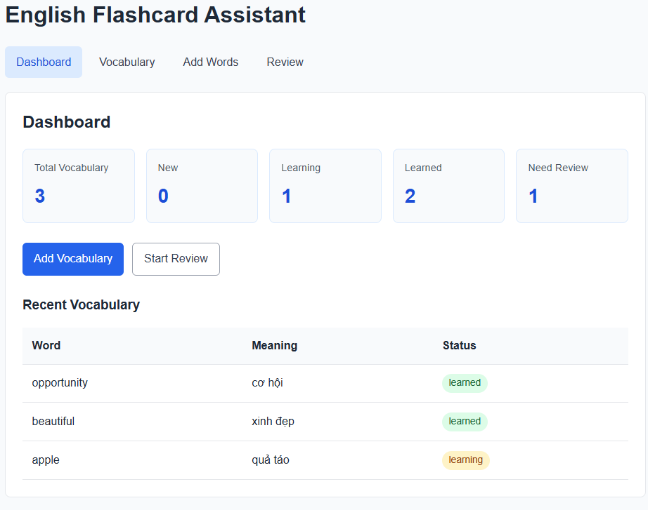
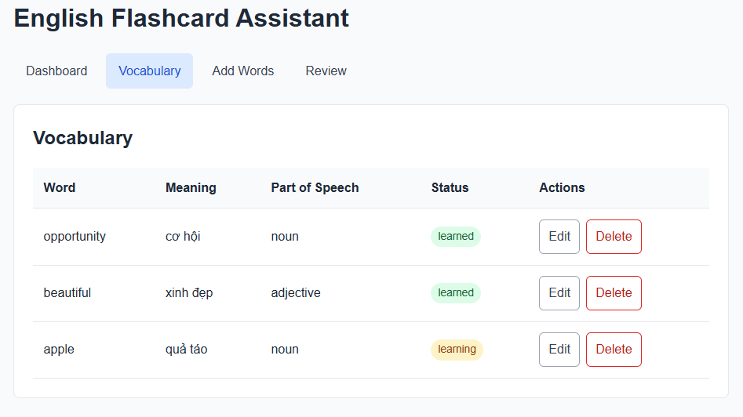
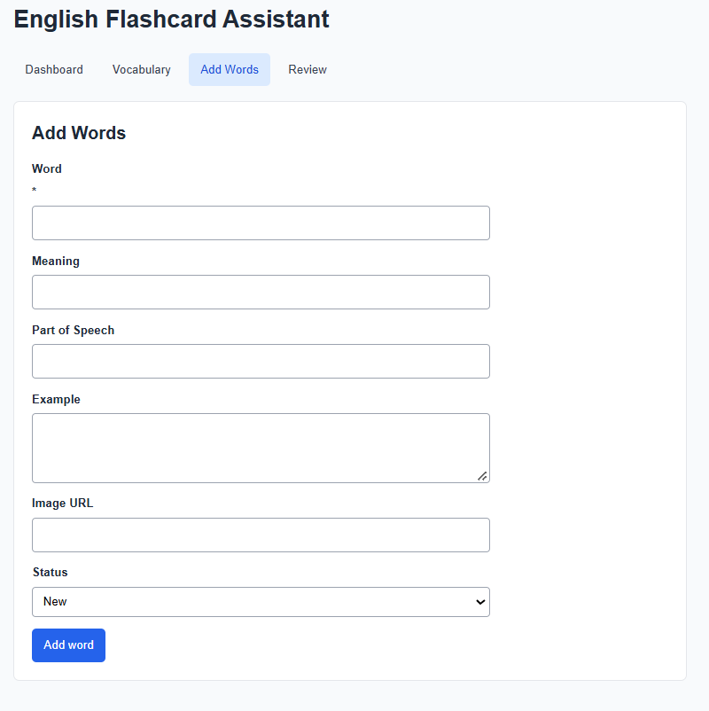
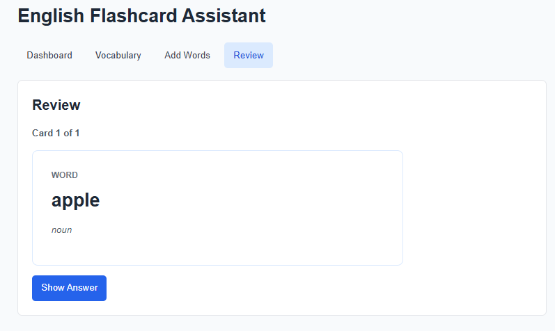

# English Flashcard Assistant

A beginner-friendly full-stack app for collecting English vocabulary, tracking learning status, and reviewing words as flashcards.

## Features

- Dashboard with vocabulary totals and review counts
- Vocabulary list with create, edit, and delete actions
- Vocabulary statuses: `new`, `learning`, and `learned`
- Flashcard review for `new` and `learning` words
- SQLite persistence and a REST API
- Responsive interface with basic accessibility and error feedback

## Tech Stack

- **Frontend:** React, Vite
- **Backend:** Node.js, Express
- **Database:** SQLite

## Project Structure

```text
english-flashcard-assistant/
├── client/                 # React + Vite frontend
│   └── src/
├── server/                 # Express + SQLite backend
│   └── src/
│       ├── database.js      # Database initialization
│       ├── index.js         # Express server
│       └── routes/          # API routes
├── docs/
│   └── screenshots/         # Portfolio screenshots
└── README.md
```

## How to Run

Use two terminals from the repository root.

1. Install and run the backend:

   ```powershell
   cd server
   npm install
   npm run dev
   ```

   The API starts at `http://localhost:3000`.

2. Install and run the frontend:

   ```powershell
   cd client
   npm install
   npm run dev
   ```

   Open the local URL shown by Vite (usually `http://localhost:5173`). Frontend `/api` requests are proxied to the backend.

## API Endpoints

Base URL: `http://localhost:3000`

| Method | Endpoint | Description |
| --- | --- | --- |
| GET | `/api/vocabularies` | List all vocabulary items |
| GET | `/api/vocabularies/:id` | Get one vocabulary item |
| POST | `/api/vocabularies` | Create a vocabulary item |
| PUT | `/api/vocabularies/:id` | Update a vocabulary item |
| DELETE | `/api/vocabularies/:id` | Delete a vocabulary item |
| PATCH | `/api/vocabularies/:id/status` | Update a vocabulary status |

Vocabulary status values are `new`, `learning`, and `learned`.

## Version 1 Status

- [x] Dashboard with vocabulary statistics
- [x] Vocabulary list and status badges
- [x] Add, edit, and delete vocabulary
- [x] Flashcard review with status updates
- [x] SQLite persistence
- [x] REST API for vocabulary CRUD
- [x] Responsive UI, loading states, and error feedback
- [x] Basic keyboard and form accessibility

## Roadmap

### Version 2

- [ ] Automatic dictionary lookup
- [ ] Pronunciation
- [ ] Image suggestions
- [ ] Improved vocabulary import

### Version 3

- [ ] OCR image import
- [ ] AI-assisted vocabulary extraction
- [ ] Spaced repetition
- [ ] Learning statistics

## Screenshots

Add portfolio screenshots at the paths below.









## Author

Do Thanh Nhan
