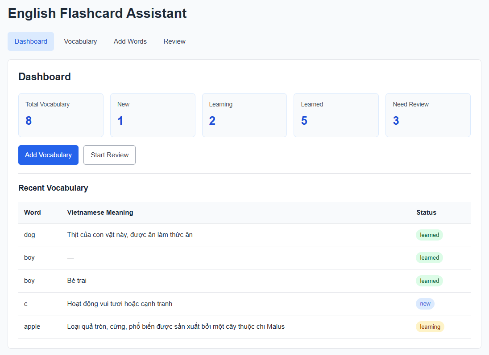
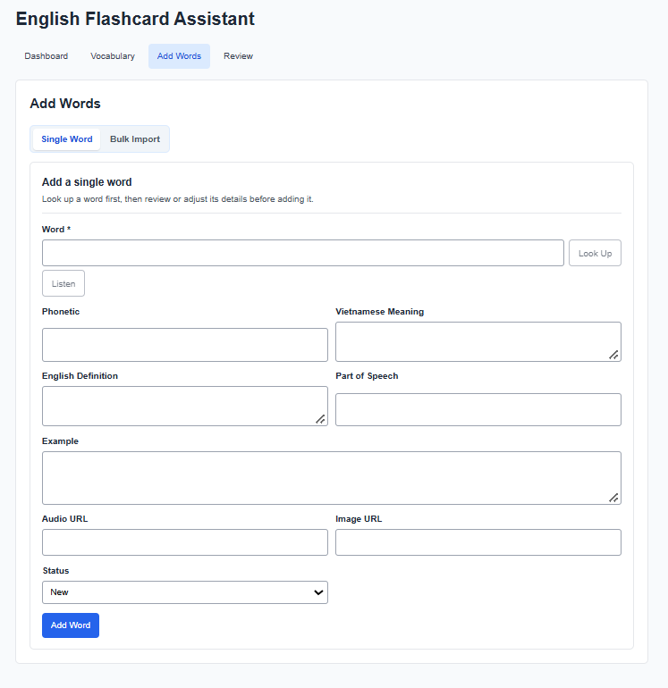
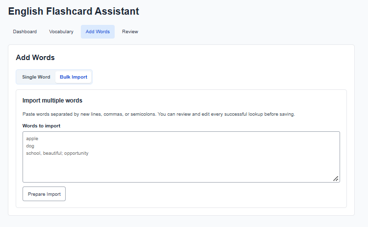
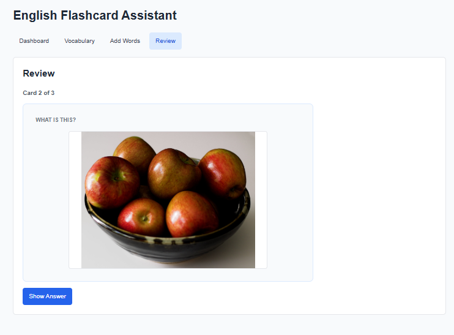

# English Flashcard Assistant

A full-stack English vocabulary app for collecting words, enriching them with dictionary data, choosing helpful images, and reviewing flashcards with an image-first flow.

## Version 2 Highlights

- Smart dictionary enrichment with English definitions, Vietnamese meanings, phonetics, examples, and pronunciation
- Image suggestions with Pexels plus Openverse and Wikimedia Commons fallbacks
- Image-first flashcard review with word-first fallback when an image is unavailable
- Bulk import with parsing, duplicate removal, three-request lookup concurrency, editable previews, and per-word image selection
- Responsive Single Word and Bulk Import workflows with accessible controls and friendly error states

## Features

- Dashboard with vocabulary and review progress totals
- Vocabulary list with edit, delete, and learning-status management
- Manual vocabulary creation or automatic dictionary lookup
- Vietnamese and English meanings, pronunciation playback, examples, and parts of speech
- Optional image suggestions and selected-image persistence
- Bulk word preparation from new lines, commas, or semicolons
- Per-item lookup, retry, selection, editing, image lookup, and save status in bulk import
- SQLite persistence and REST API

### Version 2 Feature Checklist

- [x] Dictionary lookup and learner-friendly definitions
- [x] Vietnamese translation fallback
- [x] Pronunciation playback with speech-synthesis fallback
- [x] Pexels image suggestions with Openverse/Wikimedia Commons fallbacks
- [x] Image-first review cards with broken-image fallback
- [x] Bulk import parsing and case-insensitive duplicate removal
- [x] Limited-concurrency bulk lookup (maximum three requests)
- [x] Per-word image selection before bulk saving
- [x] Responsive Single Word / Bulk Import interface
- [x] Error feedback and keyboard-focus support

## Tech Stack

- **Frontend:** React 18, Vite
- **Backend:** Node.js, Express
- **Database:** SQLite
- **External services:** FreeDictionaryAPI, MyMemory Translation, Pexels, Openverse, and Wikimedia Commons

## Project Structure

```text
english-flashcard-assistant/
├── client/                     # React + Vite frontend
│   └── src/
│       ├── api/                # API client
│       ├── components/         # Reusable UI components
│       ├── pages/              # Dashboard, Vocabulary, Add Words, Review
│       └── utils/              # Vocabulary and bulk-import helpers
├── server/                     # Express + SQLite backend
│   ├── src/
│   │   ├── routes/             # Vocabulary, dictionary, and image endpoints
│   │   ├── services/           # Translation and definition selection
│   │   └── database.js         # SQLite initialization
│   └── .env                    # Local secrets; do not commit
├── docs/screenshots/           # Portfolio screenshots
└── README.md
```

## How to Run

Use two terminals from the repository root.

1. Start the backend:

   ```powershell
   cd server
   npm install
   npm run dev
   ```

   The API runs on `http://localhost:3000` by default.

2. Start the frontend:

   ```powershell
   cd client
   npm install
   npm run dev
   ```

   Open the URL shown by Vite, usually `http://localhost:5173`. Frontend `/api` calls are proxied to the backend during development.

## Environment Variables

Create `server/.env` to enable Pexels suggestions:

```dotenv
PEXELS_API_KEY=your_pexels_api_key_here
```

Never commit `server/.env` or any real API key. The repository ignores `.env` files. A `server/.env.example` file containing placeholder values is safe to commit and share.

Without a Pexels key, image lookup continues with Openverse and Wikimedia Commons fallbacks where available.

## External Services

- **FreeDictionaryAPI:** primary English dictionary enrichment
- **MyMemory Translation:** English-to-Vietnamese meaning translation
- **Pexels:** optional image suggestions when `PEXELS_API_KEY` is configured
- **Openverse / Wikimedia Commons:** public-image fallback providers

External services are called by the backend only; the React client uses the app's API endpoints.

## API Endpoints

Base URL: `http://localhost:3000`

| Method | Endpoint | Description |
| --- | --- | --- |
| GET | `/api/health` | Check API and database availability |
| GET | `/api/vocabularies` | List vocabulary items |
| GET | `/api/vocabularies/:id` | Get one vocabulary item |
| POST | `/api/vocabularies` | Create a vocabulary item |
| PUT | `/api/vocabularies/:id` | Update a vocabulary item |
| DELETE | `/api/vocabularies/:id` | Delete a vocabulary item |
| PATCH | `/api/vocabularies/:id/status` | Update status to `new`, `learning`, or `learned` |
| GET | `/api/dictionary/:word` | Look up dictionary, phonetic, translation, example, and audio data |
| GET | `/api/images/:word` | Get image suggestions; accepts `meaning_en`, `part_of_speech`, and `page` query parameters |

## Version History

- **v1.0.0 — Core flashcard system:** vocabulary CRUD, SQLite persistence, dashboard, statuses, and flashcard review.
- **v2.0.0 — Smart vocabulary enrichment and bulk import:** dictionary and translation lookup, pronunciation, image suggestions, image-first review, and bulk vocabulary workflows.

## Roadmap

### Version 3

- [ ] OCR image import
- [ ] AI-assisted vocabulary extraction
- [ ] Spaced repetition
- [ ] Learning statistics

## Screenshots









## Author

Do Thanh Nhan
