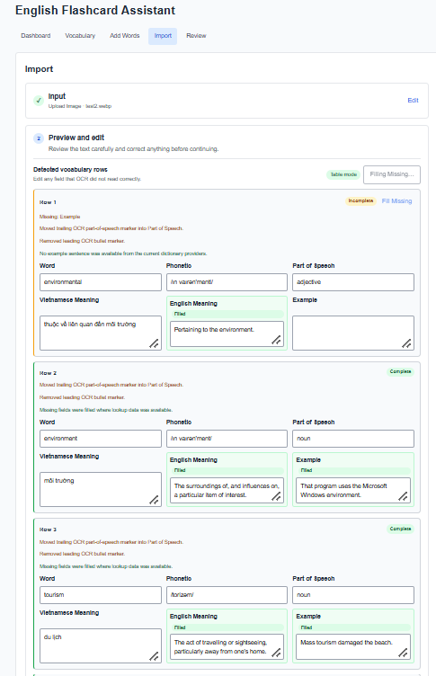
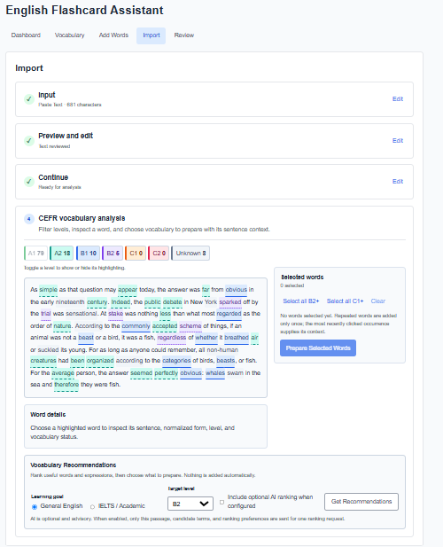
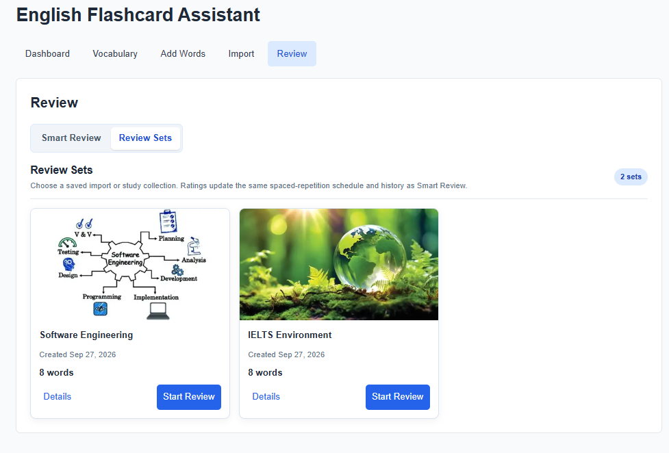
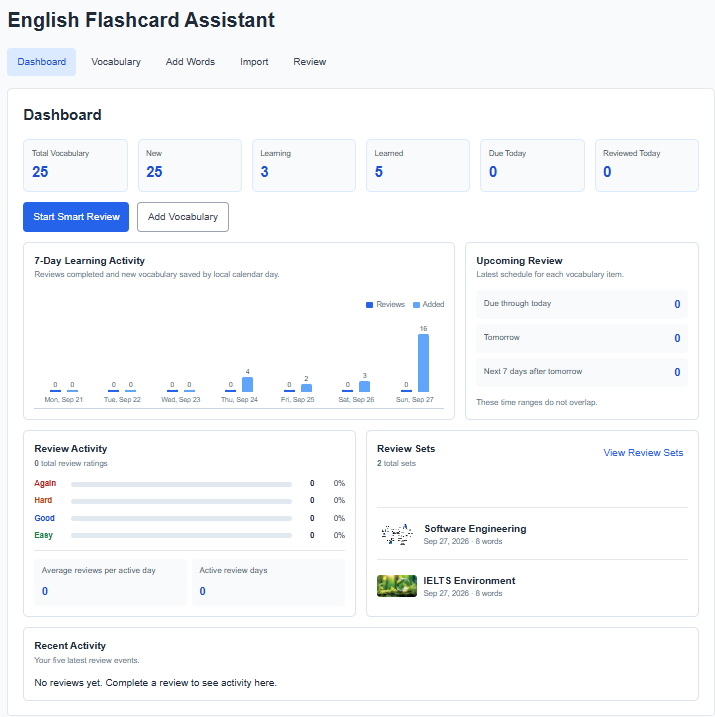
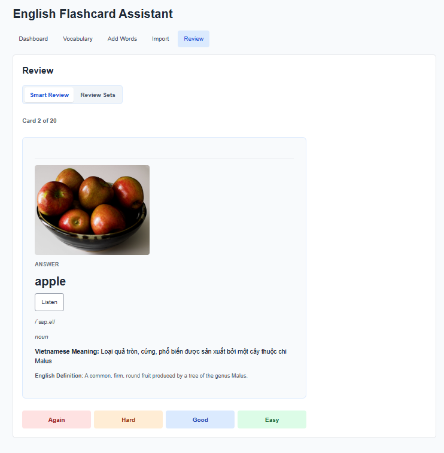

# English Flashcard Assistant

English Flashcard Assistant is a full-stack vocabulary learning application that helps users import, analyze, organize, and review English vocabulary using contextual analysis and spaced repetition.

## Version 3 at a glance

### Smart Vocabulary Import

- Add individual vocabulary manually or with dictionary lookup.
- Bulk-import words from lines, commas, or semicolons, then review editable results before saving.
- Import PNG, JPG, JPEG, and WEBP vocabulary images.
- Use OCR.space as the primary OCR provider (Engine 3 and table parsing) with Tesseract.js fallback.
- Extract structured vocabulary rows and safely enrich only fields that are blank.

### CEFR and vocabulary analysis

- Analyze pasted text token by token with CEFR A1–C2 levels.
- Highlight text, filter CEFR levels, and select vocabulary candidates.
- Quickly select B2+ or C1+ vocabulary.
- Rank recommended words and phrases into Recommended, Worth considering, and Lower priority groups.

### Context-aware vocabulary preparation

- Rank dictionary senses against the source sentence and surrounding context.
- Prepare editable English definitions, Vietnamese meanings, phonetics, parts of speech, and examples.
- Review confidence and alternative meanings before saving.

### Vocabulary Sets

- Save batches from Bulk Import, Smart Import, or CEFR preparation into a review set.
- Use a custom title and optional cover image; blank titles receive an automatic local-date title.
- Review a specific set, browse compact set details, and paginate set cards.

### Spaced-repetition review

- Study due and new vocabulary in Smart Review.
- Rate cards with Again, Hard, Good, or Easy.
- Store the resulting interval, ease factor, next review time, and review history.
- Use image-first flashcards where an image is available.

### Learning statistics

- See vocabulary totals by New, Learning, and Learned status.
- Track due/reviewed-today counts, rating distribution, and seven-day activity.
- Review upcoming work, recent activity, and recent vocabulary sets.

### Vocabulary management

- Edit or delete vocabulary and retain its learning status.
- Browse vocabulary in 10, 20, or 50-row pages.

## Tech stack

- **Frontend:** React, Vite, JavaScript, CSS
- **Backend:** Node.js, Express
- **Database:** SQLite
- **External services:** OCR.space, Tesseract.js fallback, Pexels, dictionary providers, and a translation provider

External services are called only from the backend. Browser code never receives provider secrets.

## Project structure

```text
english-flashcard-assistant/
├── client/
│   └── src/
│       ├── api/                 # Backend API clients
│       ├── components/          # Import, preparation, and reusable UI
│       ├── pages/               # Dashboard, Import, Review, Vocabulary, Add Words
│       └── utils/               # Text, bulk-import, and vocabulary helpers
├── server/
│   ├── src/
│   │   ├── data/cefr/           # Local CEFR datasets
│   │   ├── routes/              # OCR, analysis, vocabulary, review-set, statistics APIs
│   │   ├── services/            # CEFR, SRS, context, recommendation, and provider logic
│   │   └── database.js          # SQLite initialization and safe migrations
│   └── .env.example             # Environment-variable placeholders
├── docs/screenshots/            # Project screenshots
├── CHANGELOG.md
└── README.md
```

## Installation

```powershell
git clone <repository-url>
cd english-flashcard-assistant
```

Install the backend dependencies:

```powershell
cd server
npm install
```

Install the frontend dependencies:

```powershell
cd ../client
npm install
```

Copy `server/.env.example` to `server/.env`, then add the provider keys you intend to use. Provider-key placeholders include:

```dotenv
PEXELS_API_KEY=your_pexels_api_key_here
OCR_SPACE_API_KEY=your_ocr_space_api_key_here
```

Optional AI ranking settings are also documented in `server/.env.example`. Do not put real values in this README or any tracked file.

## Run the application

Use two terminals from the repository root.

Start the backend:

```powershell
cd server
npm run dev
```

The API listens on `http://localhost:3000` by default.

Start the frontend:

```powershell
cd client
npm run dev
```

Open the Vite URL shown in the terminal, usually `http://localhost:5173`.

## Testing

Run backend automated tests:

```powershell
cd server
npm test
```

Build the frontend for production:

```powershell
cd client
npm run build
```

Version 3 verification completed with **24 backend tests passing** and a successful frontend production build.

## Version 3 workflow

```text
Import text or image
  → Analyze CEFR
  → Select or accept recommendations
  → Prepare vocabulary using context
  → Save to a Vocabulary Set
  → Review with Smart Review or Review Sets
  → Track progress in the Dashboard
```

## API overview

The development API base URL is `http://localhost:3000`.

| Area | Endpoint examples |
| --- | --- |
| Vocabulary | `GET/POST /api/vocabularies`, `PUT/DELETE /api/vocabularies/:id` |
| Review | `GET /api/vocabularies/review/smart`, `POST /api/vocabularies/:id/review` |
| Vocabulary sets | `GET/POST /api/vocabulary-sets`, `GET/PATCH /api/vocabulary-sets/:id` |
| Import | `POST /api/import/ocr` |
| Analysis | `POST /api/analysis/cefr`, `/recommendations`, `/prepare-vocabulary` |
| Enrichment | `GET /api/dictionary/:word`, `GET /api/images/:word` |
| Statistics | `GET /api/statistics/dashboard` |

## Version 3 Screenshots

### Smart Import / OCR



### CEFR Analyzer



### Vocabulary Recommendations

`docs/screenshots/v3-recommendations.png` still needs to be added.

### Review Sets



### Learning Statistics Dashboard



### Smart Review / Spaced Repetition



## Security

- Store secrets only in `server/.env`.
- `server/.env` is ignored by Git.
- `server/.env.example` contains placeholders only.
- OCR, image, dictionary, translation, and optional AI provider keys remain on the server.

## Known limitations

- Dictionary, translation, OCR, and image providers require internet access and may depend on third-party availability.
- Authentication and multi-user support are not implemented.
- The current SRS is deterministic and intentionally simple; advanced FSRS scheduling is not implemented.

## Version history

- **v1.0.0:** Core vocabulary CRUD and basic review.
- **v2.0.0:** Dictionary enrichment, bilingual meanings, pronunciation, images, bulk import, and image-first flashcards.
- **v3.0.0:** Smart OCR import, CEFR analysis, contextual enrichment, recommendations, vocabulary sets, spaced repetition, review history, statistics, pagination, and UX improvements.

See [CHANGELOG.md](CHANGELOG.md) for Version 3 release notes.

## Author

Do Thanh Nhan
